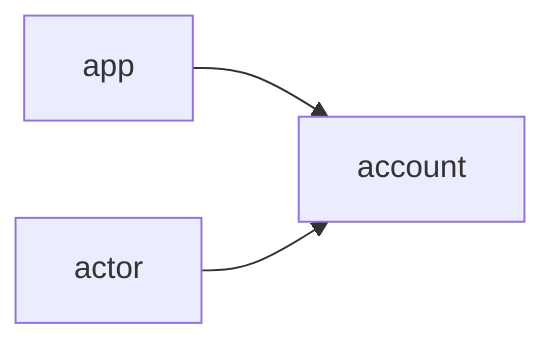

# jlinx Hypercore Spec

## Keys

### Creating a new hypercore identity

### when you can hypercore

- signing keys and hypercore keys can be the same

0. create a signing key pair on your machine
0. store the secret in a key vault
0. create your did document
  - did = `did:jlinx:${publicKey}`
  - any encrypting keys you want
0. append the first block to your hypercore microledger

### when you need a hypercore proxy

- signing keys and hypercore keys are different
- signing keys are held by your device
- hypercore keys are held by the proxy server
  - you cannot move proxy servers without superseeding your identity

1. create at least one signing key pair on your machine
2. store the secret in a key vault 
3. ask a jlinx did server to host a DID for you by posting a signed did document to it
4. server verfies the signature, creates its own hypercore keypair
  - HTTP post containing  
    - your did document as JSON string
      - *requires at least one signing key*  
    - signature of the JSON string  
  - server then
    - creates own signing keys
    - stores secret key
    - adds the did to the did docment
    - appends first message to micro-ledger
    - return the did = `did:jlinx:${hypercorePublicKey}`

### Signing a claim that you exist

- includes your did
- signed by your idenity keys

## JLINX Events

Every did is a micro-ledger of ordered events. 

### Claim you exist

Claiming you exist is the first step to others being able to make claims about you.

you must create unique crypto keys capable of signing strings

### Signup

1. an app claims to exist
2. an actor claims to exist
3. the actor does a signup ritual exchanging dids
4. the app creates a new DID Document representing the app's side of the new user account
5. the user's app creates a new DID document represent the user's side of the new user account

